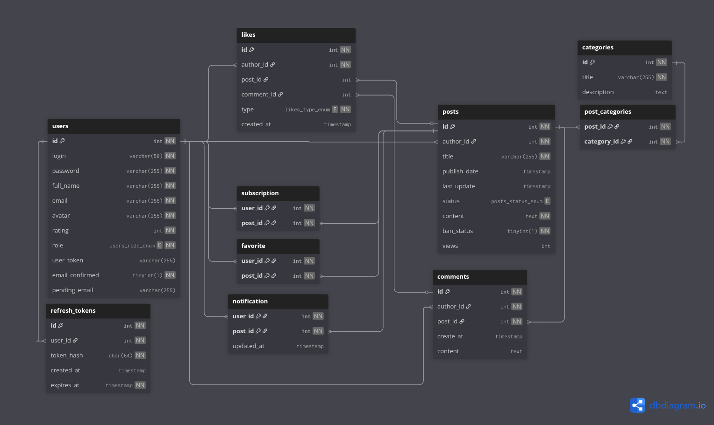

# CBL Progress & Program Documentation

## CBL Progress

### Stage 1: Requirements Analysis & Planning
- Defined the main features: user authentication, posts, comments, likes, categories, and admin panel.  
- Designed the initial database schema for **users**, **posts**, **categories**, and **likes**.  
- Selected the tech stack: **Node.js**, **Express**, **MySQL**, **Zod**, **JWT**.  

### Stage 2: Database & Basic API
- Implemented SQL schema files for all main entities.  
- Configured database connection pooling and created a base model for CRUD operations.  
- Developed initial REST API endpoints for **users**, **posts**, and **categories**.  

### Stage 3: Authentication & Authorization
- Added JWT-based authentication with access and refresh tokens.  
- Implemented **role-based access control** (user/admin).  
- Built middlewares for token validation and role checking.  

### Stage 4: Advanced Features
- Created endpoints for **likes/dislikes**, **favorites**, and **post banning**.  
- Implemented **pagination, filtering, and sorting** for posts.  
- Integrated **Zod** for request validation and improved error handling.  

### Stage 5: Admin & User Experience
- Added **admin-only endpoints** for managing users, posts, and categories.
- Enhanced validation, error messages, and overall security.
- Implemented **password reset** and **email confirmation** workflows.

### Stage 6: Advanced Features & Media Support
- Implemented **post subscription system** allowing users to follow post updates.
- Created **notification system** for alerting subscribers when posts are updated.
- Added **file system-based image upload** for posts with multipart/form-data support.
- Enhanced post management with automatic image cleanup and directory structure.

---

## Program Structure and Algorithm Overview

### Project Structure

```
/db/sql/           # SQL schema files
/models/           # Database models (CRUD and query logic)
/routes/           # Express route definitions (API endpoints)
/controllers/      # Request handlers (business logic entry point)
/services/         # Business logic and orchestration
/schemas/          # Zod validation schemas
/middlewares/      # Express middlewares (auth, validation, etc.)
/public/           # Static files
```

### Algorithm Overview

#### Initialization
1. Load environment variables (`.env`) with database and JWT config.  
2. Connect to MySQL using **connection pooling**.  
3. Initialize **Express middlewares**:  
   - JSON body parsing  
   - URL encoding  
   - Static file serving

#### Routing
- Register API routes via modular routers:
  - **/api/auth** → authentication & tokens
  - **/api/users** → user profiles & management
  - **/api/posts** → posts CRUD, likes, favorites, images, subscriptions
  - **/api/comments** → comments CRUD & likes
  - **/api/categories** → category management
  - **/api/notifications** → notification management
- Protect routes with **token validator**, **role checker**, and **request validation**.

#### Request Handling
- Controllers receive validated input and delegate to **services**.  
- Services coordinate business logic and interact with **models**.  
- Models execute parameterized SQL queries for safe CRUD operations.

#### Authentication & Authorization
- **JWT tokens** are issued on login.  
- **Access tokens** secure protected routes, **refresh tokens** manage sessions.  
- Middleware checks **roles** (user/admin) to restrict access.

#### Validation & Error Handling
- **Zod schemas** validate all incoming data.  
- Validation errors return a standardized JSON response.  
- All errors are caught in controllers and reported with `status`, `type`, and `message`.

#### Business Logic
- **Posts**: create, update, delete, like/dislike, favorite, ban, filter, paginate, image upload/management.
- **Subscriptions**: subscribe/unsubscribe to posts for update notifications.
- **Notifications**: automatic creation when subscribed posts are updated, simple deletion-based management.
- **Images**: file system storage, automatic cleanup, multipart upload handling.
- **Comments**: add, edit, delete, like/dislike.
- **Categories**: organize posts; admins can create/update/delete categories.
- **Users**: profile management, avatar upload, password reset, email confirmation.
- **Admins**: manage all users, posts, and categories. 

#### Response
- Each endpoint returns JSON with:  
  - `status` (Success/Fail)  
  - `data` (requested object or list)  
  - `message` (error or confirmation)  
---

## Database Structure

The database schema is visualized below:



The application uses a **MySQL relational database** consisting of 10 tables.
Their structure and purpose are described below.

### `users`

| Field           | Type                 | Null | Key | Default          | Extra          | Description                          |
|-----------------|----------------------|------|-----|------------------|----------------|--------------------------------------|
| id              | int                  | NO   | PRI | auto_increment   |                | Unique user identifier               |
| login           | varchar(50)          | NO   | UNI |                  |                | Username (unique)                     |
| password        | varchar(255)         | NO   |     |                  |                | Hashed password                       |
| full_name       | varchar(255)         | NO   |     |                  |                | User’s full name                      |
| email           | varchar(255)         | NO   | UNI |                  |                | User’s email (unique)                 |
| avatar          | varchar(255)         | NO   |     | def_avatar.png   |                | Profile avatar                        |
| rating          | int                  | NO   |     | 0                |                | Reputation / rating                   |
| role            | enum('admin','user') | NO   |     | user             |                | User role                             |
| user_token      | varchar(255)         | YES  |     | NULL             |                | Temporary token for reset/confirm     |
| email_confirmed | tinyint(1)           | NO   |     | 0                |                | Email confirmation status             |

---

### `posts`

| Field        | Type                      | Null | Key | Default           | Extra          | Description                     |
|--------------|---------------------------|------|-----|-------------------|----------------|---------------------------------|
| id           | int                       | NO   | PRI | auto_increment    |                | Unique post identifier          |
| author_id    | int                       | NO   | MUL |                   |                | FK → users.id                   |
| title        | varchar(255)              | NO   |     |                   |                | Post title                      |
| publish_date | timestamp                 | YES  |     | CURRENT_TIMESTAMP | DEFAULT_GEN    | Creation date                   |
| status       | enum('active','inactive') | YES  |     | active            |                | Post status                     |
| content      | text                      | NO   |     |                   |                | Post body                       |
| ban_status   | tinyint(1)                | NO   |     | 0                 |                | Whether the post is banned       |

---

### `categories`

| Field       | Type         | Null | Key | Default | Extra          | Description            |
|-------------|--------------|------|-----|---------|----------------|------------------------|
| id          | int          | NO   | PRI | auto_increment |         | Unique category ID     |
| title       | varchar(255) | NO   |     | NULL    |                | Category title         |
| description | text         | YES  |     | NULL    |                | Category description   |

---

### `post_categories`

| Field       | Type | Null | Key | Default | Extra | Description                  |
|-------------|------|------|-----|---------|-------|------------------------------|
| post_id     | int  | NO   | PRI | NULL    |       | FK → posts.id                |
| category_id | int  | NO   | PRI | NULL    |       | FK → categories.id           |

Composite PK: (post_id, category_id) ensures a post can’t be linked twice to the same category.

---

### `comments`

| Field     | Type      | Null | Key | Default           | Extra          | Description             |
|-----------|-----------|------|-----|-------------------|----------------|-------------------------|
| id        | int       | NO   | PRI | auto_increment    |                | Unique comment ID       |
| author_id | int       | NO   | MUL | NULL              |                | FK → users.id           |
| post_id   | int       | NO   | MUL | NULL              |                | FK → posts.id           |
| create_at | timestamp | YES  |     | CURRENT_TIMESTAMP | DEFAULT_GEN    | Date of comment         |
| content   | text      | YES  |     | NULL              |                | Comment text            |

---

### `likes`

| Field      | Type                   | Null | Key | Default           | Extra             | Description                                                                 |
|------------|------------------------|------|-----|-------------------|-------------------|-----------------------------------------------------------------------------|
| id         | int                    | NO   | PRI | NULL              | auto_increment    | Unique like ID                                                              |
| author_id  | int                    | NO   | MUL | NULL              |                   | FK → `users.id` (the user who reacted)                                      |
| post_id    | int                    | YES  | MUL | NULL              |                   | FK → `posts.id` (nullable, set if the reaction is on a post)                |
| comment_id | int                    | YES  | MUL | NULL              |                   | FK → `comments.id` (nullable, set if the reaction is on a comment)          |
| type       | enum('like','dislike') | NO   |     | NULL              |                   | Reaction type                                                               |
| created_at | timestamp              | YES  |     | CURRENT_TIMESTAMP | DEFAULT_GENERATED | Date and time when the reaction was created                                 |

---

#### Constraints
- One of **`post_id`** or **`comment_id`** must be non-NULL (reaction belongs to either a post or a comment, not both).  
- Unique constraint: **(author_id, post_id)** → one reaction per user per post.  
- Unique constraint: **(author_id, comment_id)** → one reaction per user per comment.  
- **ON DELETE CASCADE** recommended on both `post_id` and `comment_id` FKs so likes are removed when their target is deleted.


### `favorite`

| Field   | Type | Null | Key | Default | Extra | Description               |
|---------|------|------|-----|---------|-------|---------------------------|
| user_id | int  | NO   | PRI | NULL    |       | FK → users.id             |
| post_id | int  | NO   | PRI | NULL    |       | FK → posts.id             |

Composite PK: (user_id, post_id) ensures a user can only favorite a post once.

---

### `refresh_tokens`

| Field      | Type      | Null | Key | Default           | Extra          | Description                      |
|------------|-----------|------|-----|-------------------|----------------|----------------------------------|
| id         | int       | NO   | PRI | auto_increment    |                | Unique token record ID           |
| user_id    | int       | NO   | MUL | NULL              |                | FK → users.id                    |
| token_hash | char(64)  | NO   |     | NULL              |                | SHA-256 hash of refresh token    |
| created_at | timestamp | YES  |     | CURRENT_TIMESTAMP | DEFAULT_GEN    | When the token was created       |
| expires_at | timestamp | NO   |     | NULL              |                | When the token expires           |

---

### `subscription`

| Field   | Type | Null | Key | Default | Extra | Description               |
|---------|------|------|-----|---------|-------|---------------------------|
| user_id | int  | NO   | PRI | NULL    |       | FK → users.id             |
| post_id | int  | NO   | PRI | NULL    |       | FK → posts.id             |

Composite PK: (user_id, post_id) ensures a user can only subscribe to a post once.

---

### `notification`

| Field   | Type | Null | Key | Default | Extra | Description               |
|---------|------|------|-----|---------|-------|---------------------------|
| user_id | int  | NO   | PRI | NULL    |       | FK → users.id             |
| post_id | int  | NO   | PRI | NULL    |       | FK → posts.id             |

Composite PK: (user_id, post_id) ensures one notification per user per post.
Notifications are created when subscribed posts are updated and deleted when viewed.

---

## New Features

### Image Upload System
- **File Storage**: Images stored in filesystem at `public/uploads/posts/{post_id}/`
- **Upload Limits**: Max 10 images per post, 5MB per image
- **Supported Formats**: JPG, JPEG, PNG, GIF, BMP, WEBP
- **Auto Cleanup**: Images automatically deleted when posts are removed
- **Replacement**: Updating posts replaces all existing images

### Notification System
- **Post Subscriptions**: Users can subscribe to posts for update notifications
- **Auto Notifications**: Subscribers automatically notified when posts are updated
- **Simple Management**: Notifications deleted after viewing (no read/unread states)
- **Author Exclusion**: Post authors don't receive notifications for their own updates

---

## Author
- **Name:** Rostyslav Bryhynets  
- **Project:** USOF Backend — Q&A service inspired by StackOverflow  
- **GitHub:** [RofaBR](https://github.com/RofaBR)  